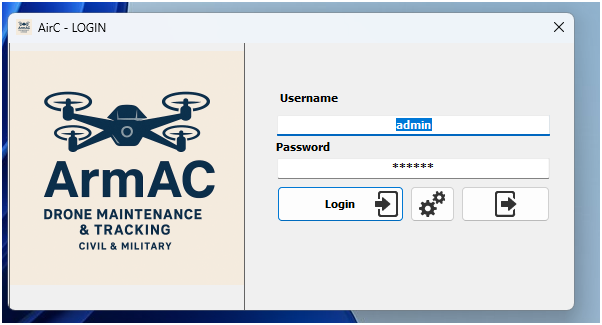
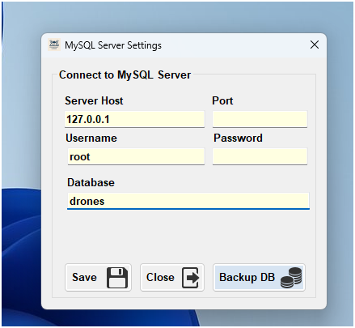
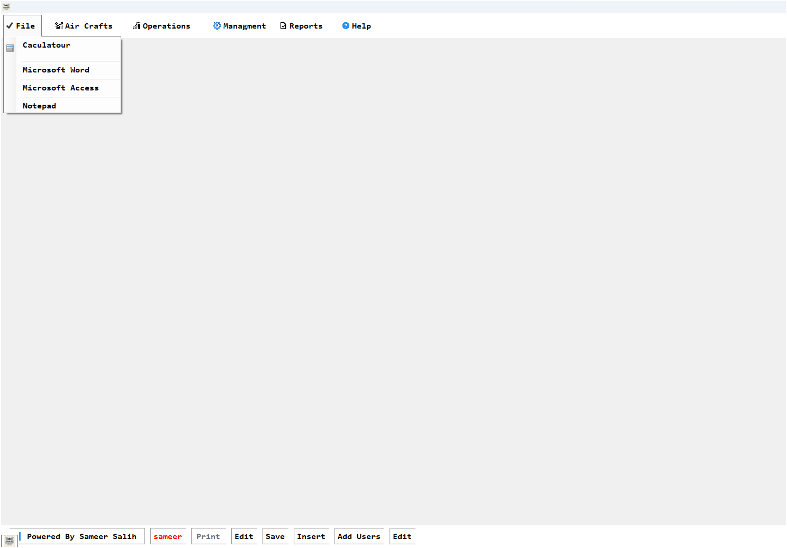
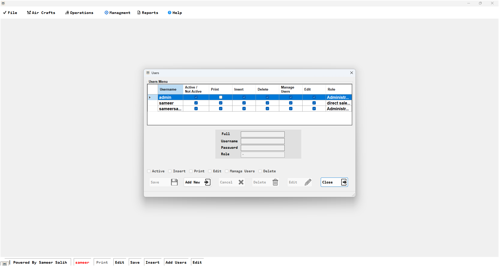
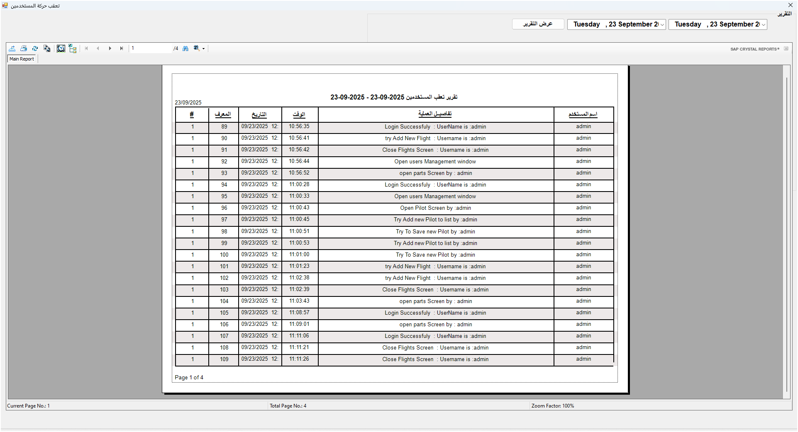
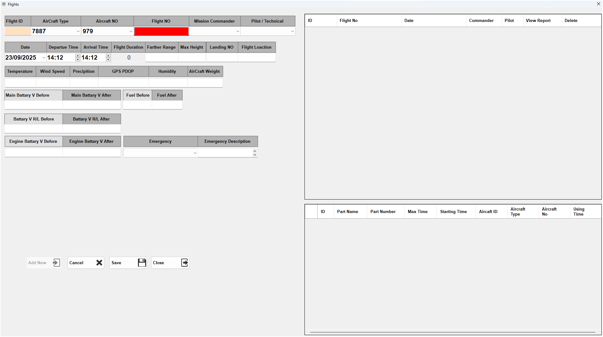
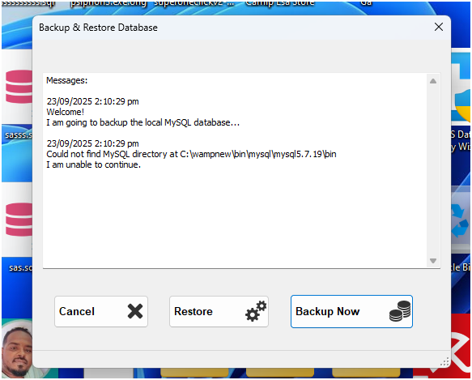

<body dir="rtl" style="text-align:center;">

<h1 style="color:red;">نظام ArmAC / Airc Sytem 2025</h1>
<h2 style="color:Yellow;">انتج بواسطة Sameer Salih </h2>
<h4>sameerssaom@gmail.com |  +24999249900 | +249912230352</h4>

 
 <h3>اسم المشروع  : 		 ArmAC</h3>
 <h5>تاريخ التصميم :		 <u>2023-2025</u></h5>
 <h5>النوع : <u>تسجيل الرحلات الجوية </u></h5>
 <h5>Language : <u>Visual Basic.NET</u></h5>
 <h5>قاعدة البيانات : <u>Mysql</u></h5>
 <h5>التقارير : <u>Crystal Report</u></h5>
 <h5>أدوات أخرى : <u>Adobe Photoshop</u></h5>
 <h5>اسم المطور  : <u>Sameer Salih | سمير صالح</u></h5>
 
 # الغرض :
 نظام لتعقب الرحلات الجوية للطائرات المسيرة لتسجيل الاستهلاك و صلاحية القطع و الأجزاء و مراقبة الأعطال و الصيانة
 
 
 
 
 نماذج لواجهات النظام
 

#  شاشة تسجيل الدخول :

#	 إعدادات السيرفر وقاعدة البيانات :

# تغيير كلمة المرور :

# الواجهة :

# إدارة المستخدمين :

# تقرير الدخول و تعقب المستخدمين :

# الطلعات الجوية: 

#  النسخ الاحتياطي للبيانات :

#  حماية البيانات
استخدمنا خوازميات التشفير مثل md5 لحماية الدخول و تشفير البيانات

# بيانات الدخول

اسم المستخدم : admin

كلمة المرور : admin

مرفق ملف قاعدة البيانات تحت اسم db.sql   
يحتوي على قاعدة البيانات الأساسية مع كامل الكودالمصدري للنظام  
قم بنسخ قاعدة البيانات على السيرفر الخاص بك  عند تشغيل النظام ادخل معلومات الدخول
  
  هذا النظام ديناميكي بالكامل 	

</body>